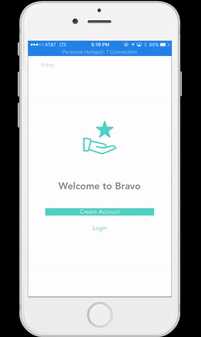

# *Bravo*

This is a real time employee recognition and feedback app to encourage employee productivity and collaboration through micro bonuses. Employees give and receive timely and meaningful praise and recognition -- increasing motivation, productivity, and retention. Organization/Team Admins can create rewards like an extra day off, free lunch etc. Employees can redeem the points they earn for these rewards. Employees can send bonuses to peers with 4 simple required fields: number of points, recipient, a reason and a category. This app also has a leaderboard to promote healthy competition among employees. 

User Stories: 
- [x] Users can sign up with email/username and password
- [x] Users should be able to create teams
- [x] Users should be able to search for teams and join teams
- [x] Users should be able to give bonus points to other members of their team with the following requirements : number of points, recipient, a reason and a category
- [x] Users receive push notifications when they receive a reward
- [x] Users should able to view an activity feed of their team/organization and react to posts
- [x] Users can search activity for other users recognized within a category 
- [x] Users can view a history of their own activity 
- [x] Team Admins can create rewards
- [x] Users can redeem their points for rewards
- [x] Users can sign up with facebook
- [x] Rewards Leaderboard

## Video Walkthrough

Here's a walkthrough of the app:

## License

    Copyright 2016 Bravo

    Licensed under the Apache License, Version 2.0 (the "License");
    you may not use this file except in compliance with the License.
    You may obtain a copy of the License at

        http://www.apache.org/licenses/LICENSE-2.0

    Unless required by applicable law or agreed to in writing, software
    distributed under the License is distributed on an "AS IS" BASIS,
    WITHOUT WARRANTIES OR CONDITIONS OF ANY KIND, either express or implied.
    See the License for the specific language governing permissions and
    limitations under the License.
